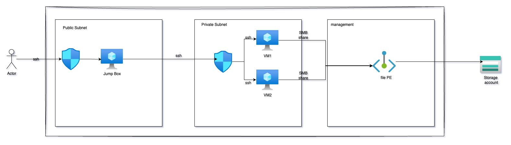

# HN Secure Azure Infrastructure – Terraform

## Deliverables
 
- **Login into Microsoft Azure Linux Server** with AD Account
- **2x Ubuntu 22.04 VMs** in a private subnet
- **Jump Box (bastion)** with public IP for SSH access
- **Secured Azure Storage Account** with:
  - Server-side encryption
  - Lifecycle rules (archive after 7 days, delete after 365)
  - Mounted Azure File Share via SMB
- **Network Security Groups (NSGs)** to restrict access
- **Infrastructure as Code (IaC)** via modular Terraform

---

## Approach to Design and implementation
This project is a reference implementation of a secure, production-ready Azure infrastructure** for HN's DevOps Technical Challenge. It applies security, scalability, redundancy, and governance best practices using Terraform. I have approached this by looking at the strategic direction of HN as a company, studying DevOps Engineer job description provided to understand the type of person and technologies required and of course the Technical challenge document that detailed the requirements. Hence, the followings are considered:

### Security-First Architecture
- Jump box with restricted access via SSH keys and NSG
- VMs in private subnet with no public IPs
- Storage encryption with HTTPS only and Azure-managed keys
- All Terraform is access-controlled

### IaC
- Entire infrastructure built via Terraform (idempotent, modular)
- SSH keys managed securely via keyvault
- Utilise AD login for SSH

### Disaster Recovery
- Storage accounts configured with GRS for geo-redundancy

---

## Diagram

---

## Project Structure

HN-ASSIGNMENT
├── terraform.yml
├── .gitignore
├── README.md
├── terraform/
    ├── files/
         │── cloud-init.tmpl
    ├── backend.tf
    ├── compute.tf
    ├── data.tf
    ├── identity.tf
    ├── keyvault.tf
    ├── locals.tf
    ├── network.tf
    ├── policy.tf             
    ├── providers.tf
    ├── storage.tf            
    ├── terraform.auto.tfvars
    ├── variables.tf         
    ├── versions.tf
    └── .gitignore
└── scripts/
    ├── init-github.sh/
    ├── setup-backend.sh/

---

##  Prerequisites

- [Terraform >=1.12](https://www.terraform.io/)
- Azure CLI (`az login`)
- Azure subscription with permissions to create resources
- SSH key pair for VM access

---

## Usage

### Clone the Repository
git clone https://github.com/YOUR_GITHUB/HN-Azure-IaC.git  
cd HN-Azure-IaC/terraform

### Copy Azure Credentials to environment 
export ARM_CLIENT_SECRET='xxxxxxxxxxxxxxxxxxx'
export ARM_CLIENT_ID='xxxxxxxxxxxxxxxxxxxxxxx'
export ARM_SUBSCRIPTION_ID='xxxxxxxxxxxxxxxxx'
export ARM_TENANT_ID='xxxxxxxxxxxxxxxxxxxxxxx'

### Login to Azure with Service Principal 
az login --service-principal --username $ARM_CLIENT_ID --password $ARM_CLIENT_SECRET --tenant $ARM_TENANT_ID

env|grep -i arm_

### Replace `YOUR_PUBLIC_IP/32` in `locals.tf`

### Initialize Terraform
terraform init

### Review and Apply the Plan
terraform plan
terraform apply

## Possible Enhancement

- Integrate Terraform security using checkov
- Automation using policy-as-code and infrastructure-as-code for compliance - ISO27001 & ISO13485, GDPR
- Logs captured via Azure Monitor
- Integrate CI/CD process
- Having recovery service vault and backup policies to support DR

